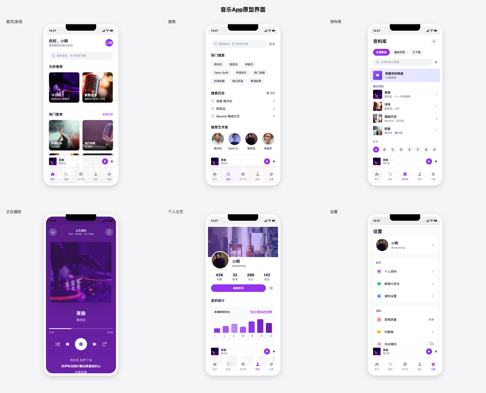
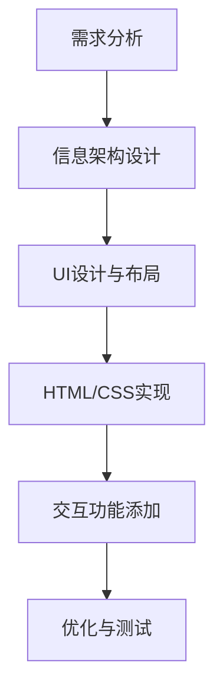

# 提示词 

```
你是一位资深全栈工程师，参考 ui_ux_design 设计一个【音乐类 app】，模拟产品经理提出需求和信息架构，请自己构思好功能需求和界面，然后设计 UI/UX。

- 产品界面规划：作为产品经理，定义关键界面，确保信息架构合理。
- 用户体验分析：先分析这个 App 的主要功能和用户需求，确定核心交互逻辑。
- 高保真 UI 设计：作为 UI 设计师，设计贴近真实 iOS/Android 设计规范的界面，使用现代化的 UI 元素，使其具有良好的视觉体验。
- HTML 原型实现：使用 HTML + Tailwind CSS（或 Bootstrap）生成所有原型界面，并使用 FontAwesome（或其他开源 UI 组件）让界面更加精美、接近真实的 App 设计。拆分代码文件，保持结构清晰。
- 每个界面应作为独立的 HTML 文件存放，例如 home.html、profile.html、settings.html 等。- index.html 作为主入口，不直接写入所有界面的 HTML 代码，而是使用 iframe 的方式嵌入这些 HTML 片段，并将所有页面直接平铺展示在 index 页面中，而不是跳转链接。
- 真实感增强：界面尺寸应模拟 iPhone 15 Pro，并让界面圆角化，使其更像真实的手机界面。  
- 使用真实的 UI 图片，而非占位符图片（可从 Unsplash、Pexels、Apple 官方 UI 资源中选择）。  
- 添加顶部状态栏（模拟 iOS 状态栏），并包含 App 导航栏（类似 iOS 底部 Tab Bar）。
- 请按照以上要求生成完整的 HTML 代码，并确保其可用于实际开发。
- 可以滑动的页面不要显示滚动条
- 如果单个页面代码量大，可以分次写入
- 使用 sequentialthinking 逐步分析
```

# 音乐App UI设计

一个基于HTML、Tailwind CSS和JavaScript构建的高保真音乐应用界面原型，针对iPhone设计优化。



## 项目简介

这个项目展示了一个现代化音乐应用的UI界面设计，包含多个功能页面：

- 首页/发现页：展示推荐内容、热门歌单和最近播放
- 搜索页：提供搜索功能和热门分类
- 资料库：管理用户收藏的音乐和播放列表
- 播放页面：提供完整的音乐播放控制和歌词显示
- 个人主页：展示用户信息和收听统计
- 设置页面：应用设置选项

## 技术栈

- HTML5 语义化标签
- Tailwind CSS 实现响应式设计
- FontAwesome 提供图标支持
- 原生JavaScript 实现交互逻辑

## 特色功能

- 模拟iOS界面风格，包括状态栏和底部导航
- 自适应界面设计，针对iPhone 15 Pro优化
- 沉浸式播放界面体验
- 隐藏滚动条，保持界面美观

## 文件结构

```
.
├── index.html          # 主入口，展示所有界面
├── home.html           # 首页/发现页
├── search.html         # 搜索页面
├── library.html        # 个人资料库
├── player.html         # 播放界面
├── profile.html        # 用户个人主页
├── settings.html       # 设置页面
├── css/
│   └── style.css       # 自定义样式
├── js/
│   ├── app.js          # 主应用逻辑
│   └── player.js       # 播放器逻辑
└── images/             # 图片资源目录
```

## 设计流程



## 设计稿展示

以下展示了本项目的设计资源和视觉演示，包括设计流程和项目封面等。

### 设计流程演示

这组图片展示了从设计构思到实现的完整流程：

#### 1. 设计工作流

通过Cursor AI进行高效率UI设计的操作流程，展示了从提示词到界面设计的转换过程：


#### 2. 高完成度设计

展示从线框图到完整界面的高效率转换，实现一次性高完成度设计：


#### 3. 无缝协作流程

从设计到代码再到发布的完整协作流程，实现一气呵成的开发体验：


#### 4. 创意实现过程

展示了从创意构思到最终实现的思维导图和创作过程：


### 高效开发演示

展示如何在一杯咖啡的时间内完成通常需要一周的设计工作，对比传统设计方法与Cursor AI辅助设计的效率差异：


### 项目封面与结尾

<div align="center">
  
  
</div>

左图为项目封面设计，展示"零代码搞定高保真App UI设计"的核心理念；右图为视频结尾画面，呈现"只需一杯咖啡的时间，完成一周的工作"的效率提升价值。

## 使用方法

1. 克隆仓库到本地
2. 打开`index.html`查看所有界面
3. 点击各个界面查看详情

## 未来计划

- 添加深色模式支持
- 实现更多动画效果
- 提供用户自定义主题功能
- 完善播放器功能

## 许可

本项目仅用于学习和演示目的。 