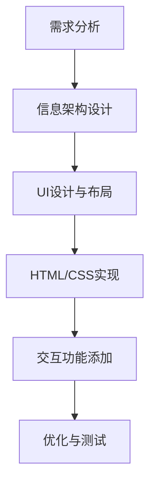

# 音乐App UI设计

一个基于HTML、Tailwind CSS和JavaScript构建的高保真音乐应用界面原型，针对iPhone设计优化。


## 项目简介

这个项目展示了一个现代化音乐应用的UI界面设计，包含多个功能页面：

- 首页/发现页：展示推荐内容、热门歌单和最近播放
- 搜索页：提供搜索功能和热门分类
- 资料库：管理用户收藏的音乐和播放列表
- 播放页面：提供完整的音乐播放控制和歌词显示
- 个人主页：展示用户信息和收听统计
- 设置页面：应用设置选项

## 技术栈

- HTML5 语义化标签
- Tailwind CSS 实现响应式设计
- FontAwesome 提供图标支持
- 原生JavaScript 实现交互逻辑

## 特色功能

- 模拟iOS界面风格，包括状态栏和底部导航
- 自适应界面设计，针对iPhone 15 Pro优化
- 沉浸式播放界面体验
- 隐藏滚动条，保持界面美观

## 文件结构

```
.
├── index.html          # 主入口，展示所有界面
├── home.html           # 首页/发现页
├── search.html         # 搜索页面
├── library.html        # 个人资料库
├── player.html         # 播放界面
├── profile.html        # 用户个人主页
├── settings.html       # 设置页面
├── css/
│   └── style.css       # 自定义样式
├── js/
│   ├── app.js          # 主应用逻辑
│   └── player.js       # 播放器逻辑
└── images/             # 图片资源目录
```

## 设计流程



## 使用方法

1. 克隆仓库到本地
2. 打开`index.html`查看所有界面
3. 点击各个界面查看详情

## 未来计划

- 添加深色模式支持
- 实现更多动画效果
- 提供用户自定义主题功能
- 完善播放器功能

## 许可

本项目仅用于学习和演示目的。 